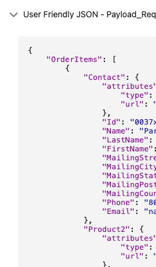

# Exception Tracker JSON Viewer

A Lightning Web Component (LWC) that renders JSON data in a user-friendly, collapsible format without requiring any external libraries or Apex code.

## Features

- Automatically formats and displays JSON data from a Salesforce record field
- Collapsible accordion interface for easy viewing
- Color-coded syntax highlighting
- Handles nested JSON structures
- Error handling for invalid JSON
- No external dependencies required

## Usage

Add the component to your Lightning page or app and configure the following attributes:
- `recordId` (required): The ID of the Salesforce record containing the JSON data
- `fieldApiName` (optional): The API name of the field containing the JSON data
  - Default: `Exception_Tracker__c.Message__c`
  - Format: `ObjectApiName.FieldApiName`

## Sample Output

